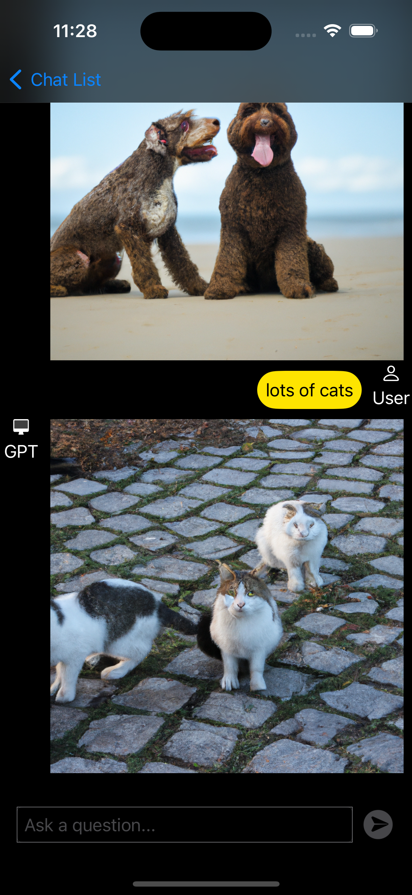

# ChatGPT API를 이용한 채팅앱

<div align="center">
  
</div>

## ChatGTP란

Chat GPT란 인터넷에 있는 셀 수 없이 많은 데이터들을 기반으로 학습된 모델로 사용자가 질문을 하면 그 질문에 대한 답을 해주는 AI로 머신러닝, 딥러닝을 기반으로 학습된 모델을 사용합니다.
 
오픈AI는 이렇게 학습된 모델을 서버에 올려 모든 사람들이 사용할 수 있게끔 만들어 두었으며 사용자는 https://chatgpt.com 링크에 접속하여 https://chatgpt.com 에서 제공하는 인터페이스로 학습된 모델을 사용만 하면 됩니다.

## SPM
### 다음 링크를 활용하여 SPM으로 패키지를 추가해줍니다.
```
https://github.com/MacPaw/OpenAI.git
```

## API 키 발급받기
아래 링크를 타고 API 키를 발급받습니다.
https://platform.openai.com/account/api-keys
### 발급받은 API 키를 다음처럼 넣어줍니다.

<div align="center">
  
</div>

## KeyChain 사용하여 API Key 저장
```swift
func saveToken(token: String) throws {
    let tokenData = Data(token.utf8)
    let query: [String: Any] = [kSecClass as String: kSecClassGenericPassword, // keychain Item Class
                                kSecAttrService as String: "openAI_Token",
                                kSecValueData as String: tokenData] // 저장할 아이템의 데이터
    
    // 먼저 기존 항목이 있는지 확인하고 있으면 업데이트합니다.
    let status = SecItemAdd(query as CFDictionary, nil)
    
    if status == errSecDuplicateItem {
        // 기존 키체인이 있는 경우 업데이트합니다.
        let attributesToUpdate: [String: Any] = [kSecValueData as String: tokenData]
        let updateQuery: [String: Any] = [kSecClass as String: kSecClassGenericPassword,
                                          kSecAttrService as String: "openAI_Token"]
        
        let updateStatus = SecItemUpdate(updateQuery as CFDictionary, attributesToUpdate as CFDictionary)
        guard updateStatus == errSecSuccess else { throw KeychainError.unhandledError(status: updateStatus) }
    } else {
        // 기존 키체인이 없는 경우 추가합니다.
        guard status == errSecSuccess else { throw KeychainError.unhandledError(status: status) }
    }
}
```

## 패키지 사용
### 패키지 사용을 위해 다음처럼 import 해줍니다
```swift
import OpenAI
```

## Model 만들기
### 대화방 모델 만들기
API를 통해 주고받은 대화방을 저장하기 위해서 Model를 다음과 같이 구현해줍니다.

```swift
enum Category: String, Codable {
    case text
    case image
}

extension Conversation: Identifiable {}

@Model
class Conversation: Hashable {
    init(id: String, category: Int, messages: [Message] = [], created: Date) {
        self.id = id
        self.category = category
        self.messages = messages
        self.created = created
    }
    
    typealias ID = String
    
    let id: String
    var category: Int
    var messages: [Message]
    var created: Date
}
```

SwiftData 프레임워크에 @Model를 사용하여 를 사용하여 데이터를 영구적으로 저장할 수 있습니다.

### 메시지 모델 만들기
대화방에서 저장되는 Message는 다음과 같습니다. 이때 확인할 수 있는 부분은 content의 타입이 Data로 되어 있는데 이것은 content에 String데이터와 Image데이터 또한 저장하기 위해서 Data로 사용하였습니다.
```swift
@Model
class Message {
    @Attribute(.unique) var id: String
    var role: ChatQuery.ChatCompletionMessageParam.Role
    var content: Data
    var createdAt: Date
    
    init(id: String, role: ChatQuery.ChatCompletionMessageParam.Role, content: Data, createdAt: Date) {
        self.id = id
        self.role = role
        self.content = content
        self.createdAt = createdAt
    }
    
}
extension Message: Identifiable {}
```

## 이미지 요청하기
이미지 요청을 하 위해서는 **ImagesQuery**로 Query를 만들어 images(query:_)에 사용합니다. 해당 이미지는 Data 타입으로 가져오는 것이 아닌 String 타입의 URL로 해당 이미지의 데이터로 가져오기 때문에 Alamofire를 이용하여 해당 URL로부터 이미지 데이터를 받아옵니다. 이때 이미지를 포함한 URL은 영구적인 것이 아니라 시간이 지나면 이미지가 사라지기 때문에 SwiftData 프레임워크를 이용하여 데이터를 영구 저장합니다.
```swift
    @MainActor
    func getImage(conversation: Conversation, prompt: String, n: Int) async {
        let query = ImagesQuery(prompt: prompt, model: .dall_e_2,n: 1, size: ._1024)
        openAIClient.images(query: query) { result in
            switch result {
            case .success(let result):
                if let url = result.data.first?.url {
                    AF.request(url)
                        .validate(statusCode: 200..<300)
                        .responseData { response in
                            switch response.result {
                            case .success:
                                if let data = response.data {
                                    conversation.messages.append(Message(id: UUID().uuidString, role: .assistant, content: data, createdAt: Date()))
                                }
                            case .failure(let error):
                                print(error.localizedDescription)
                            }
                        }
                }
            case .failure(let error):
                print(error.localizedDescription)
            }
        }
    }
```

<div align="center">
  
</div>

## 음성 녹음하기
음성을 녹음을 하기 위해서는 AVFoundation 프레임워크를 사용합니다. 녹음을 하기 위해서는 delegate를 self로 설정하고 record()를 사용합니다. 추가로 isMeteringEnabled를 true로 만들어 사용자로부터 녹음되는 음성의 데이터를 측정할 수 있도록 합니다.
```swift
audioRecorder = try AVAudioRecorder(url: captureURL, settings: [
    AVFormatIDKey: Int(kAudioFormatMPEG4AAC),
    AVSampleRateKey: 12000,
    AVNumberOfChannelsKey: 1,
    AVEncoderAudioQualityKey: AVAudioQuality.high.rawValue
])
audioRecorder.isMeteringEnabled = true
audioRecorder.delegate = self
audioRecorder.record()
```
### 음성 녹음 데이터 측정
음성을 녹음하는 데이터를 0.2초마다 측정하여 측정한 데이터를 저장합니다, 만약 이전 데이터들을 비교하여 15번 이상 차이가 별로 없을 경우에 녹음을 중단합니다.
```swift
animationTimer = Timer.scheduledTimer(withTimeInterval: 0.2, repeats: true, block: { [unowned self] _ in
    guard self.audioRecorder != nil else { return }
    self.audioRecorder.updateMeters()
    let power = min(1, max(0, 1 - abs(Double(self.audioRecorder.averagePower(forChannel: 0)) / 50) ))
    
    self.audioPower = power
    self.AddAudioPower(value: audioPower)
    
    self.audioLevelHistory.append(power)
    if self.audioLevelHistory.count > 15 {
        self.audioLevelHistory.removeFirst()
    }
    
    if self.checkAudioLevelsConsistency() {
        self.finishCaptureAudio()
    }
})
```

추가로 1.6초마다 음성 데이터를 측정하여 주변 소음이 너무 작으면 음성을 측정하지 않는 것으로 간주하여 음성 녹음을 취소합니다.
```swift
recordingTimer = Timer.scheduledTimer(withTimeInterval: 1.6, repeats: true, block: { [unowned self] _ in
    guard self.audioRecorder != nil else { return }
    self.audioRecorder.updateMeters()
    let power = min(1, max(0, 1 - abs(Double(self.audioRecorder.averagePower(forChannel: 0)) / 50) ))
    if self.prevAudioPower == nil {
        self.prevAudioPower = power
        return
    }
    if let preAudioPower = self.prevAudioPower, preAudioPower < 0.25 && power < 0.175 {
        self.finishCaptureAudio()
    }
    self.prevAudioPower = power
})
```

## 음성으로 대화

### 음성 텍스트 변환
음성으로 대화하기 위해서 첫 번째 단계로는 음성을 Data 타입으로 AudioTranscriptionQuery를 통해서 데이터를 담아 텍스트로 변환시킵니다.

```swift
let data = try Data(contentsOf: captureURL)
let query = AudioTranscriptionQuery(file: data, fileType: AudioTranscriptionQuery.FileType(rawValue: "audio.m4a") ?? .m4a, model: .whisper_1)
// 음성을 텍스트로 변환하기

try Task.checkCancellation()

let result = try await openAIClient.audioTranscriptions(query: query)
```

### 텍스트에 대한 값 텍스트로 반환
음성 데이터로부터 변환시킨 String에 대한 값을 gpt에 물어 해당 String 데이터를 받습니다.
```swift
let query2 = CompletionsQuery(model: "gpt-3.5-turbo-instruct", prompt: result.text, temperature: 0, maxTokens: 4000, topP: 1, frequencyPenalty: 0, presencePenalty: 0, stop: ["\\n"])
let result2 = try await openAIClient.completions(query: query2)
```

### 텍스트 음성 변환
질문으로부터 받은 응답 텍스트를 음성으로 변환시켜 해당 음성 데이터를 mp3 형식으로 출력시킵니다.
```swift
let query3 = AudioSpeechQuery(model: .tts_1, input: textArray.description, voice: selectedVoice, responseFormat: .mp3, speed: 1.0)
let result3 = try await openAIClient.audioCreateSpeech(query: query3)
print(result3.audio)
try playAudio(data: result3.audio)
```

### 음성 파일 재생
음성 파일을 재생하는 코드입니다.
```swift
func playAudio(data: Data) throws {
    self.state = .playingSpeech
    audioPlayer = try AVAudioPlayer(data: data)
    audioPlayer.delegate = self
    audioPlayer.play()
}
```

## 언어 선택
### 언어 선택 모델
언어를 선택할 때 environment의 \.locale를 설정하여 언어를 바꿀 수 있습니다.
```swift
@Observable
class LanguageSetting {
    var locale = Locale(identifier: "ko")
}
```

### 언어 설정 저장
보안과 관련없는 언어설정을 영구적으로 저장하기 위해서 AppStorage를 선택하였습니다.
```swift
@AppStorage("userLanguageKey") private var locale = "en"
```

<div align="center">
  
</div>

